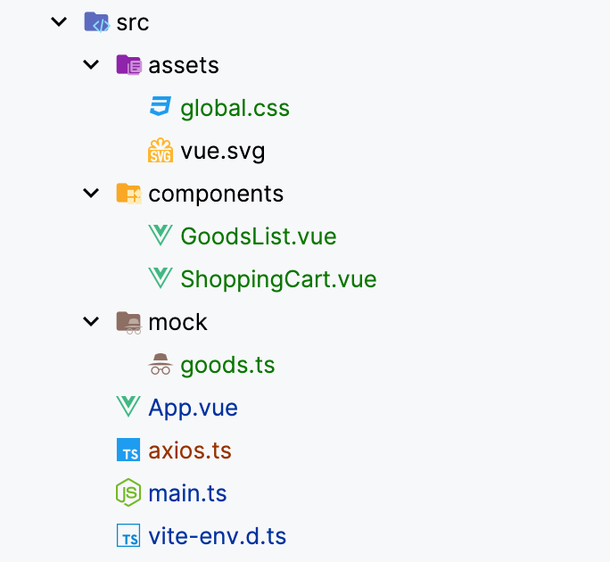
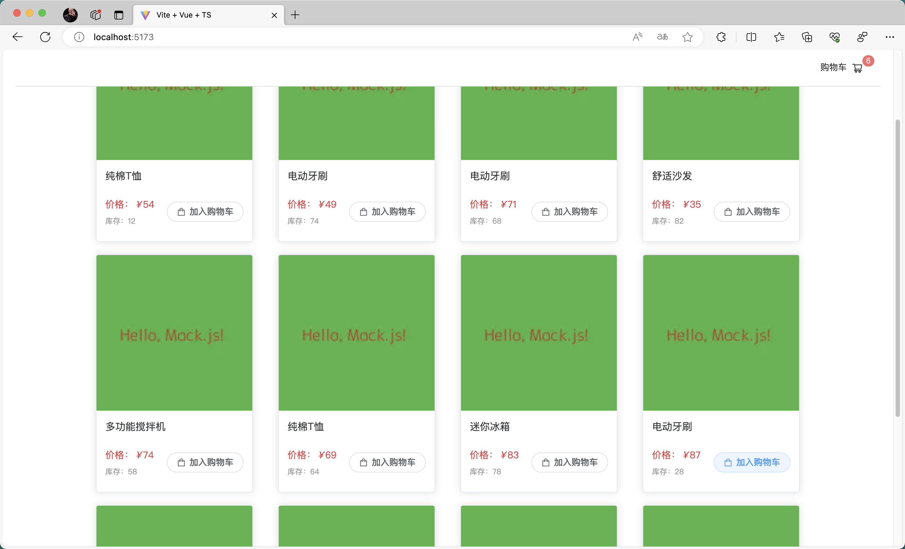
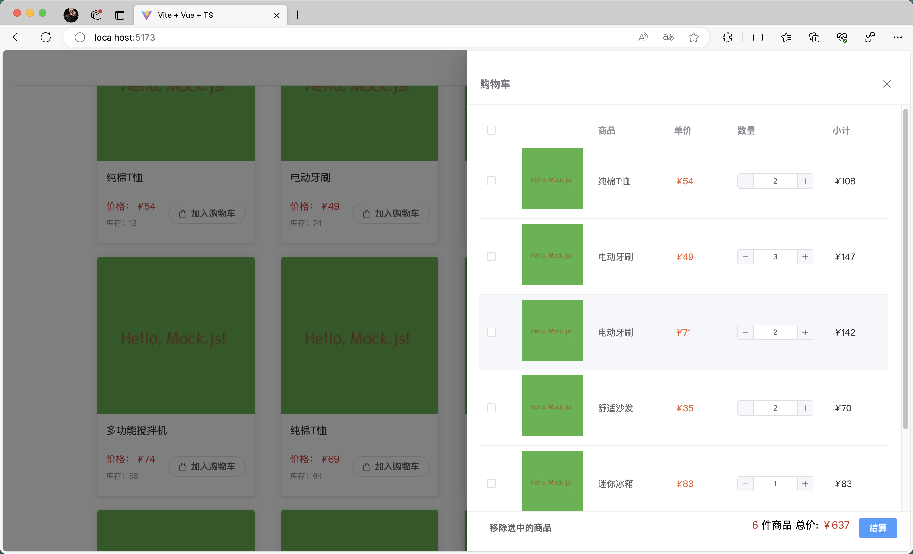

# 购物车样例

## 一、需求梳理
1. 首先要提供一个页面给用户浏览商品，让用户去挑选哪些商品加入到购物车中。 
展示具体的商品信息时应该要有商品名、商品图片、商品单价、商品库存

2. 在购物车中要给出以下操作和功能让用户可以编辑购物车当中的商品：
   - 选中一个或多个商品移出购物车
   - 添加/减少/输入某个商品的数量（商品数量最多不能超过库存，最少不能低于1）
   - 结算 
3. 在购物车界面，还需要提供以下信息：
    - 金额总计
    - 商品件数

## 二、流程设计

## 三、方案实现 
这是一个 vue3.x + typescript 的项目，组合式 API 风格，在这个案例中商品数据是使用 mockjs 拦截请求并生成随机数据返回的 
使用到的第三方包有：
- axios
- mockjs
- element-plus
- ant-design
1. 工程目录
 

2. 效果展示

